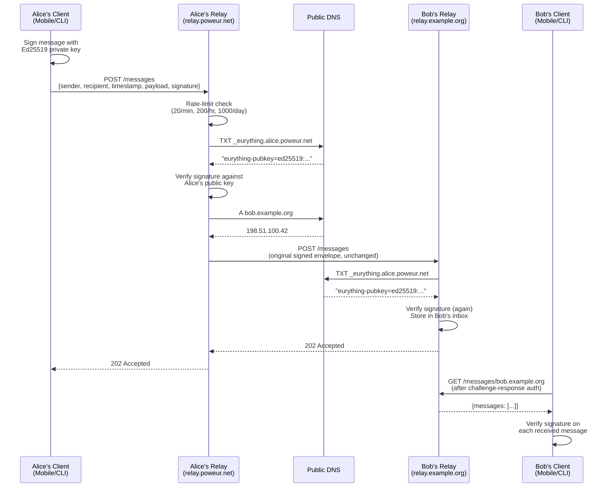

# Routing

The Eurything Protocol uses DNS as its routing layer. Every identity subdomain points to the relay that handles messages for that identity. Any relay anywhere in the world can route to any identity by performing a standard DNS lookup — no central routing registry, no relay coordination required.

## Routing Flow

The full delivery path for a message from Alice (`alice.poweur.net`) to Bob (`bob.example.org`):



## Step-by-Step Breakdown

### 1. Client signs and submits

Alice's app constructs the message and signs the canonical string (sender + recipient + timestamp + payload) with her private Ed25519 key. The signed message is submitted to Alice's configured relay via `POST /messages`.

### 2. Sender relay rate-limits

Alice's relay checks the per-sender rate limit counters **before** performing any expensive work. If the sender is within limits, processing continues. If not, the relay responds immediately with `429 Too Many Requests` without touching DNS or the message content.

### 3. Sender relay verifies signature

Alice's relay resolves `_eurything.alice.poweur.net` as a `TXT` record to retrieve Alice's public key, then verifies the message signature. If verification fails, `401 Unauthorized` is returned. This step ensures the relay only forwards legitimately signed messages.

### 4. Sender relay resolves recipient

Alice's relay inspects the `recipient` field. If `bob.example.org` is not a locally hosted identity, the relay resolves `bob.example.org` as a DNS `A` (or `CNAME`) record to find Bob's relay IP address. Resolved addresses are cached for the DNS record's TTL to avoid a DNS round-trip on every message.

### 5. Sender relay forwards

Alice's relay forwards the **original signed envelope** (unchanged) to Bob's relay via `POST /messages` over HTTPS.

### 6. Recipient relay verifies and stores

Bob's relay performs the same signature verification (re-resolving Alice's public key from DNS), confirms that `bob.example.org` is a locally hosted identity, and stores the message in Bob's in-memory inbox.

### 7. Bob fetches

Bob's client polls `GET /messages/bob.example.org` (or receives a push notification if WebSocket delivery is available). Bob's relay returns all pending inbox messages. Bob's client should verify the signature on each received message as a final trust check, even though the relay has already verified it.

## Local vs. Remote Recipients

When a relay receives a `POST /messages` request, it determines delivery strategy based on whether the recipient is local:

- **Local identity** — the recipient's subdomain resolves to this relay's own address (or is registered on this relay). The message is verified and stored in the local inbox.
- **Remote identity** — the recipient's subdomain resolves to a different IP address. The relay forwards the original signed envelope to that address via `POST /messages`.

Relays do **not** re-sign messages when forwarding. The original sender's signature travels end-to-end, and each relay in the path verifies it independently.

## DNS Routing Cache

To avoid a DNS lookup on every message, relays maintain an in-memory cache of resolved relay addresses, keyed by recipient subdomain. Cache entries expire at the DNS record's TTL. On a cache miss, the relay performs a fresh DNS resolution.

The cache is ephemeral — it is lost on relay restart. On restart, the first message to each remote identity triggers a fresh DNS lookup. This is acceptable; the overhead is a single DNS round-trip.

## Horizontal Scaling

Because the relay is stateless and routing is DNS-driven, horizontal scaling requires no coordination:

1. Add relay instances behind a load balancer.
2. The load balancer's IP is what DNS `A` records point to.
3. Any relay instance can accept, verify, and forward any message.

Inbox messages are held in-memory per-instance in the MVP. For production workloads, a shared in-memory store (e.g. Redis) or a message queue would be substituted for the local inbox — but this is a post-MVP concern.

## Operator Setup

For an operator hosting multiple identities on a single relay, all identity subdomains should point to the same relay (via a shared `CNAME` target or the same `A` record). For example:

```
; All identities on relay.poweur.net
alice.poweur.net.  300  IN  CNAME  relay.poweur.net.
bob.poweur.net.    300  IN  CNAME  relay.poweur.net.
carol.poweur.net.  300  IN  CNAME  relay.poweur.net.
relay.poweur.net.  300  IN  A      95.217.142.10
```

A single wildcard TLS certificate (`*.poweur.net`) covers all identity subdomains. See [TLS Configuration](/security/tls) for details.

## Related

- [DNS Records](/protocol/dns-records)
- [Rate Limiting](/protocol/rate-limiting)
- [Relay Overview](/relay/overview)
- [API Reference](/relay/api-reference)
